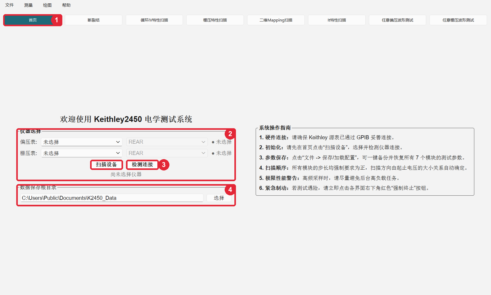
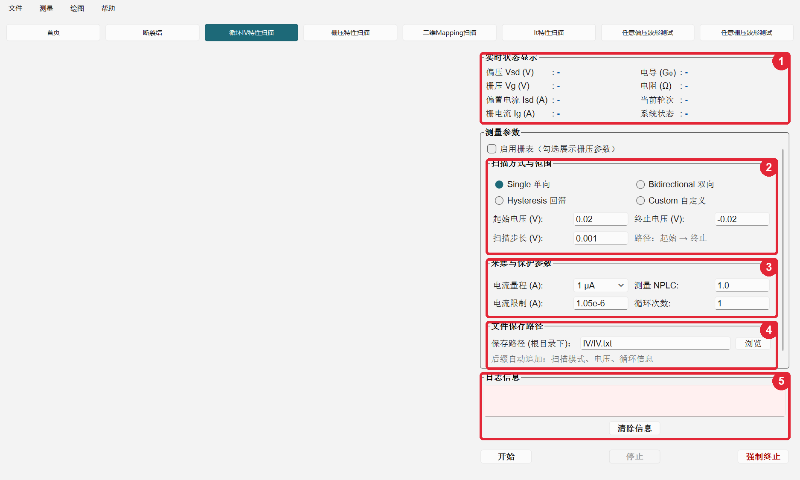
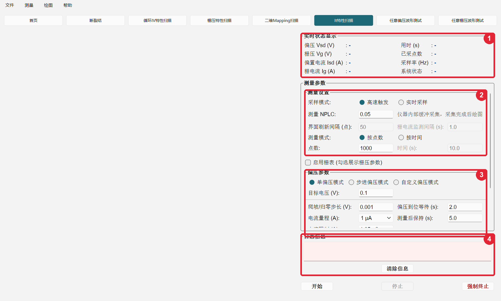
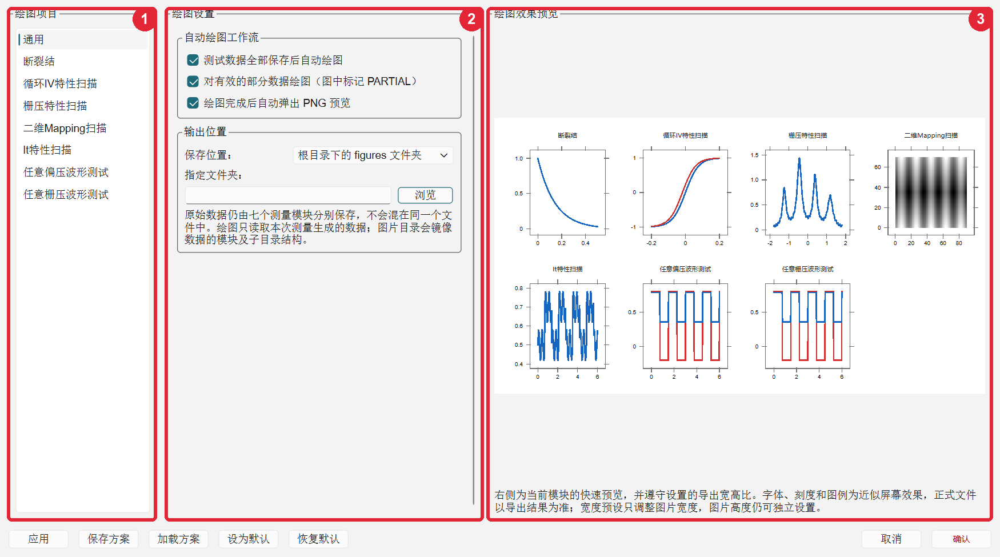

# Keithley 2450 单分子电学测量系统

面向 Keithley 2450 SourceMeter 的 Windows 桌面版单分子测量程序。系统通过 PyVISA 控制一台或两台 2450，统一提供七个测量模块、实时状态显示、安全停止、数据保存，以及自动绘图。

> [!CAUTION]
> 本程序会直接控制源表输出。第一次连接真实器件前，请使用低电压、合适的电流限制和已知负载验证接线、端子、量程、普通停止与强制终止。任何时候都应以仪器面板的实际输出状态为最终依据。

## 目录

- [下载与启动](#下载与启动)
- [第一次测量](#第一次测量)
- [界面说明](#界面说明)
- [七个测量模块](#七个测量模块)
- [关键参数与安全机制](#关键参数与安全机制)
- [数据、图片与备份命名](#数据图片与备份命名)
- [绘图设置](#绘图设置)
- [配置方案](#配置方案)
- [从源码运行](#从源码运行)
- [测试与打包](#测试与打包)
- [常见问题](#常见问题)

## 下载与启动

### Windows 发布包

1. 打开 [GitHub Releases](https://github.com/lewshannon305/K2450-electrical-test-system/releases/latest)。
2. 下载 `K2450-Electrical-Test-System-Windows-x64.zip` 并解压。

发布包不要求安装 Python。请保留 EXE 旁的 `runtime` 和 `configs` 文件夹；**只复制 EXE 会导致程序无法正常启动**。

### 仪器与驱动

- Windows 10 或 Windows 11
- 一台或两台 Keithley 2450 SourceMeter
- NI-VISA、Keithley I/O Layer 或其他可被 PyVISA 识别的 VISA 后端
- GPIB、USB-TMC 或局域网 VISA 连接

程序会通过 `*IDN?` 检查仪器型号，目前只接受 Keithley 2450。双表测量时，两台仪器必须使用不同的 VISA 地址。

## 第一次测量

建议按以下顺序完成第一次上机：

1. 关闭源表输出，检查样品、地线、偏压表与栅压表的接线。
2. 在首页点击“扫描设备”，分别选择偏压表、栅压表和 `FRONT`/`REAR` 端子。
3. 点击“检测连接”，确认地址、型号和连接状态正确。
4. 选择数据根目录。默认位置为 `C:\Users\Public\Documents\K2450_Data`，也可以手动输入或点击“选择”。
5. 打开目标模块，先设置较小的电压、合适的电流量程和电流限制。
6. 检查模块内的相对保存路径，然后开始一次短测量。
7. 核对实时状态、日志、数据列、元数据和仪器面板状态。
8. 需要中断时优先点击“停止”；只有异常或紧急情况才使用“强制终止”。

## 界面说明

### 首页



1. **模块导航**：在首页和七个测量模块之间切换。
2. **仪器选择**：选择偏压表、栅压表及前后端子。只使用一台表的模块可以不选择栅压表。
3. **扫描与检测**：“扫描设备”刷新 VISA 资源；“检测连接”确认所选仪器是否可用。
4. **数据保存根目录**：所有模块的数据目录和默认 `figures` 图片目录都以这里为根目录。

### 测量模块的通用结构

下图以循环 IV 为例。不同模块的参数名称不同，但页面结构和操作顺序一致。



1. **实时状态显示**：显示实际回读的电压、电流、进度、轮次和系统状态。
2. **扫描方式与范围**：选择单向、双向、回滞或自定义序列，并设置起止电压和步长。
3. **采集与保护参数**：设置电流量程、限制、NPLC 和循环次数。
4. **文件保存路径**：填写根目录下的相对目录和文件名。
5. **日志信息**：显示初始化、扫描、停止、归零、保存和错误信息。

页面最下方的“开始”执行测量，“停止”请求安全结束，“强制终止”立即进入紧急关断流程。

### It 的采样与测量模式



1. **实时状态**：显示当前偏压、栅压、电流、用时、采样率和系统状态。
2. **测量设置**：选择“高速触发”或“实时采样”，并选择按点数或按时间结束。
3. **偏压参数**：偏压支持单值、步进和自定义序列；继续向下可设置共用的量程、限制、步长和等待参数。
4. **日志信息**：查看采样、切换、保存和安全停止过程。保存路径位于参数区下方，可通过滚动条查看。

## 七个测量模块

| 模块 | 所需仪器 | 主要用途 |
| --- | --- | --- |
| 断裂结 | 偏压表 | 自适应偏压步进与电导反馈，记录电压、电流和以 $G_0$ 表示的电导 |
| 循环 IV 特性扫描 | 偏压表；栅压表可选 | 单向、双向、回滞或自定义偏压序列；可配合单值、步进或自定义栅压 |
| 栅压特性扫描 | 偏压表和栅压表 | 在固定源漏偏压下完成四段栅压扫描，记录 $I_{\mathrm{sd}}$ 与 $I_{\mathrm g}$ |
| 二维 Mapping 扫描 | 偏压表和栅压表 | 执行栅压—偏压二维扫描，生成电流、平滑电流和微分电导 Mapping |
| It 特性扫描 | 偏压表；栅压表可选 | 固定或序列偏压/栅压下的时间采集，支持高速触发和实时采样 |
| 任意偏压波形测试 | 偏压表；栅压表可选 | 编辑多段偏压和持续时间，可配合固定栅压执行波形测量 |
| 任意栅压波形测试 | 偏压表和栅压表 | 在固定偏压下执行多段自定义栅压波形并采集 $I_{\mathrm{sd}}$ |

### 时域模块的两种采样方式

It、任意偏压和任意栅压使用相同的采样概念：

- **高速触发**：主要由 2450 内部触发模型和缓冲区采集，完成后批量传输数据。测量期间不逐点读取 $I_{\mathrm g}$，因此只依赖仪器硬件限流。
- **实时采样**：电脑连续读取 $I_{\mathrm {sd}}$ 并按设置刷新界面；启用栅表时会周期性读取 $I_{\mathrm g}$，达到电流限制后触发软件安全停止。
- **按点数**和**按时间**只决定结束条件，不改变高速/实时采样方式。
- NPLC 越小通常采样越快、噪声越高；实际采样率还受量程、自动调零、总线、固件和电脑负载影响。

Keithley 2450 没有专用 digitize 功能。高速采样能力应以每次结果元数据中记录的实际采样率和时间间隔为准。

## 关键参数与安全机制

### 偏压表

- `电流量程 (A)`决定电流测量的固定量程。
- 选择固定量程后，`电流限制 (A)`会自动填写为量程的 $1.05$ 倍，之后仍可手动修改。
- 断裂结使用后台自动电流量程，因此前台只显示电流限制。
- 电流限制既用于仪器硬件保护，也作为相应测量流程的安全边界。

### 栅压表

所有使用栅压表的模块统一显示：

- `电压量程 (V)`：下拉框提供 Keithley 2450 的 `0.2 V`、`2 V`、`20 V`、`200 V` 四个固定硬件量程，默认选择 `20 V`。
- `电流限制 (A)`：默认 `1e-9 A`。

栅电流测量量程固定在后台为 `1e-8 A`，不在界面显示，也不作为用户配置保存。栅表启用输出前，程序会设置并回读确认电压量程、电流量程和电流限制。

在能够读取 $I_{\mathrm g}$ 的模式中，若 $|I_{\mathrm g}|$ 达到或超过电流限制，程序会停止后续采集、执行归零并关闭输出。高速模式不读取 $I_{\mathrm g}$，只有 Keithley 的硬件限流保护。

### NPLC 与等待参数

- `测量 NPLC`：积分时间，以电网周期为单位。较大值通常噪声更低、速度更慢。
- `偏压/栅压单步延时`：每次改变对应源电压后的短暂等待。
- `偏压/栅压到位等待`：爬坡到目标电压后、正式测量前的等待。
- `栅压组间等待`：一组栅压测量结束后到下一组开始前的等待。
- `偏压归零后等待`：偏压回到零后继续等待的时间。
- `测量后保持`：正式采集完成后维持当前条件的时间。
- `跃变缓冲时延`：任意波形发生电平跃变后预留的缓冲时间。

这些等待用于给仪器输出、线缆、电容和样品响应留出稳定时间。最合适的数值取决于器件与接线，不应机械地追求最短。

### 停止与强制终止

- **停止**：请求测量线程在安全位置结束，保存已有有效数据，然后按正常流程归零和关闭输出。
- **强制终止**：立即中断当前流程，直接执行归零、输出关闭和状态回读。仅用于普通停止不能及时响应或存在风险时。
- `complete` 表示正常归零并确认关闭。
- `emergency_off` 表示强制终止后已确认归零和关闭，同样属于安全关断成功。
- `unconfirmed` 表示无法确认零电压或输出关闭，界面会显示最高级安全告警。此时应立即检查仪器面板和接线。

关闭程序窗口时，如果仍有测量运行，程序会先阻止直接退出并进入停止流程。

## 数据、图片与备份命名

### 根目录与模块路径

首页只设置一次数据根目录。每个模块继续保留“保存路径 (根目录下)”输入框，用于决定模块子目录和文件名。

例如：

```text
首页根目录：C:\Data
循环 IV 保存路径：IV/IV.txt
```

结果结构为：

```text
C:\Data\
├── IV\
│   ├── IV.txt
│   └── metadata\
│       └── IV_meta.json
└── figures\
    └── IV\
        ├── IV.svg
        ├── IV.pdf
        └── IV.png
```

默认图片目录始终比数据目录多一层 `figures`，后面的模块目录与数据路径保持一致。若在绘图设置中指定其他图片根目录，则该目录替代 `根目录/figures`，模块和子目录结构仍然保留。

### 重复测量与部分结果

程序不会静默覆盖已有数据。同名测量依次保存为：

```text
IV.txt
IV_backup001.txt
IV_backup002.txt
```

相应的元数据和自动图片使用同一批次名称。若结果未完整完成，`_partial` 放在扩展名前：

```text
IV_backup001_partial.txt
```

同一份数据被手动重复绘图时，图片会覆盖，不额外生成 `_backup001`，从而保持图片与来源数据一一对应。

### Mapping 的保存与绘图

Mapping 会把预扫描数据放入 `pos`，正式完整扫描数据放入 `full`。

默认自动绘图：

- 不绘制 `pos` 数据；
- 使用 `full` 数据生成原始电流 Mapping、平滑电流 Mapping 和微分电导 Mapping；
- 三张 Mapping 保存到 `figures/Mapping` 对应的逻辑目录；
- 只有在绘图设置中启用“导出 full 中全部 IV”时，才为每个栅压的 full-IV 生成单独图片；
- 可另行启用 full-IV 汇总图。

### 数据格式与元数据

测量数据使用制表符分隔的文本文件，可由 Origin、Excel、Python 或 MATLAB 读取。元数据保存在同级 `metadata` 文件夹，通常包含：

- 模块名称、时间和完成状态；
- 仪器型号、VISA 地址和端子；
- 实际量程、电流限制、NPLC 和扫描参数；
- 高速/实时模式、实际采样率和时间间隔统计；
- 是否启用栅电流软件监测，以及是否因 $I_g$ 超限停止；
- 完整、部分、停止或错误原因。

发生异常时，应结合原始数据、元数据、界面日志和仪器状态判断结果，不能只看最终曲线。

## 绘图设置

从顶部“绘图”菜单打开“绘图设置”。



1. **绘图项目**：切换通用设置和七个模块的专用设置；各页面保留自己的滚动位置。
2. **绘图设置**：调整自动绘图、目录、尺寸、字体、坐标、颜色、图例和模块专用参数。
3. **绘图效果预览**：PyQtGraph 快速预览遵守导出宽高比，用于检查布局；正式文件仍以 Matplotlib 导出结果为准。

窗口底部可以应用、保存、加载、设为默认、恢复默认、取消或确认绘图方案。

正式绘图默认同时生成：

- SVG：适合继续编辑，文字保持可编辑；
- PDF：适合论文排版和矢量输出；
- PNG：默认 `450 DPI`，适合快速查看和插入文档。

通用与模块设置包括 Nature 单栏 `89 mm`、1.5 栏 `120 mm`、双栏 `183 mm` 宽度预设，独立图片高度、字体、字号、线宽、四边框、刻度、坐标范围、颜色和图例位置。当前 Mapping 使用带 colorbar 的蓝—红发散配色；循环 IV 图例默认位于左上角；栅压特性默认使用无缝拼图方式。

绘图菜单还提供：

- 测量结束后自动绘图；
- 绘制最近一次测试；
- 查看最近绘图；
- 打开最近绘图目录。

## 配置方案

“文件”菜单可以保存或加载七个模块的参数和绘图设置。项目自带默认配置 `configs/default.json`。

当前配置结构版本为 `4`，不提供旧配置迁移。加载其他版本或结构不完整的配置时，程序会拒绝应用，避免把未知字段带入测量。

专用方案可能包含不同的器件电压、波形和量程。加载后必须逐项检查关键参数，不应把方案名称当作接线和安全条件已经正确的证明。

## 从源码运行

### 1. 获取源码

```powershell
git clone https://github.com/lewshannon305/K2450-electrical-test-system.git
cd K2450-electrical-test-system
```

### 2. 创建虚拟环境

```powershell
py -m venv .venv
.\.venv\Scripts\Activate.ps1
python -m pip install --upgrade pip
pip install -r requirements.txt
```

### 3. 检查 VISA 资源

```powershell
python -c "import pyvisa; print(pyvisa.ResourceManager().list_resources())"
```

返回空元组或 VISA library 错误时，应先安装或修复 VISA 后端。

### 4. 启动程序

```powershell
python main.py
```

主要依赖为 PyQt6、PyQtGraph、PyVISA、NumPy、SciPy、Matplotlib 和 Markdown，最低版本以 `requirements.txt` 为准。

## 测试与打包

运行全部自动化测试：

```powershell
python -m unittest discover -s tests -t . -v
```

本地生成 Windows 发布包：

```powershell
powershell -ExecutionPolicy Bypass -File packaging\build_windows.ps1
```

打包脚本会先运行测试，再构建 onedir 应用，并检查 Matplotlib 的 SVG、PDF 和 PNG/Agg 后端。构建产物只写入 `.build`，不会自动提交、推送或发布 GitHub。

自动化测试和模拟仪器不能代替实验室实机验证。更换电脑、VISA 后端、线缆、固件、端子或样品后，建议重新执行低风险连接、短测量、停止、强制终止、重复保存和三种图片导出测试。

## 常见问题

### 扫描不到仪器

1. 确认 VISA 后端已经安装；
2. 用厂商工具检查仪器地址；
3. 确认 GPIB/USB/LAN 线缆和仪器接口已启用；
4. 关闭其他正在独占仪器的程序；
5. 重新点击“扫描设备”。

### 检测连接失败

确认选择的是 Keithley 2450、两台表地址不重复，并检查 `FRONT`/`REAR` 端子是否与实际接线一致。

### 点击开始后立即报参数错误

重点检查：

- 起止电压与步长方向；
- 目标电压是否位于所选电压量程内；
- 电流限制是否为正且不超过允许范围；
- 保存路径是否可写；
- 自定义序列或波形是否为空；
- 两台仪器是否被其他模块占用。

### 高速模式为什么没有栅电流曲线

高速模式不逐点读取 $I_\mathrm g$，这是采集机制限制，不是显示错误。需要软件监测栅电流时，请使用实时模式。

### 为什么图片没有生成在数据文件旁边

默认图片根目录是 `数据根目录/figures`，随后镜像数据的模块和子目录结构。可在绘图设置中改为指定图片根目录。

### 为什么出现 `_backup001`

目标数据文件已经存在。程序通过 `_backup001`、`_backup002` 递增命名保护旧数据，不会自动覆盖。

### 停止后仍显示安全告警

如果程序无法回读确认零电压或输出关闭，会显示 `unconfirmed`。不要继续测量，应立即查看两台仪器面板，手动关闭输出并排查通信或接线问题。

## 实验前检查清单

- [ ] 偏压表和栅压表地址没有选反
- [ ] `FRONT`/`REAR` 端子与实际接线一致
- [ ] 输出初始为关闭状态
- [ ] 电压范围适合当前样品
- [ ] 偏压电流量程和电流限制合理
- [ ] 栅压量程和栅电流限制合理
- [ ] NPLC、步长及等待时间符合实验目的
- [ ] 数据根目录和模块保存路径正确且可写
- [ ] 已用低风险条件验证停止与强制终止
- [ ] 测量结束后仪器输出已确认关闭

## 免责声明

本项目用于科研测量与软件开发，不替代仪器手册、实验室电气安全规范或样品保护流程。使用者应自行确认接线、量程、限流、端子、接地和输出状态，并对实验设备和样品安全负责。
